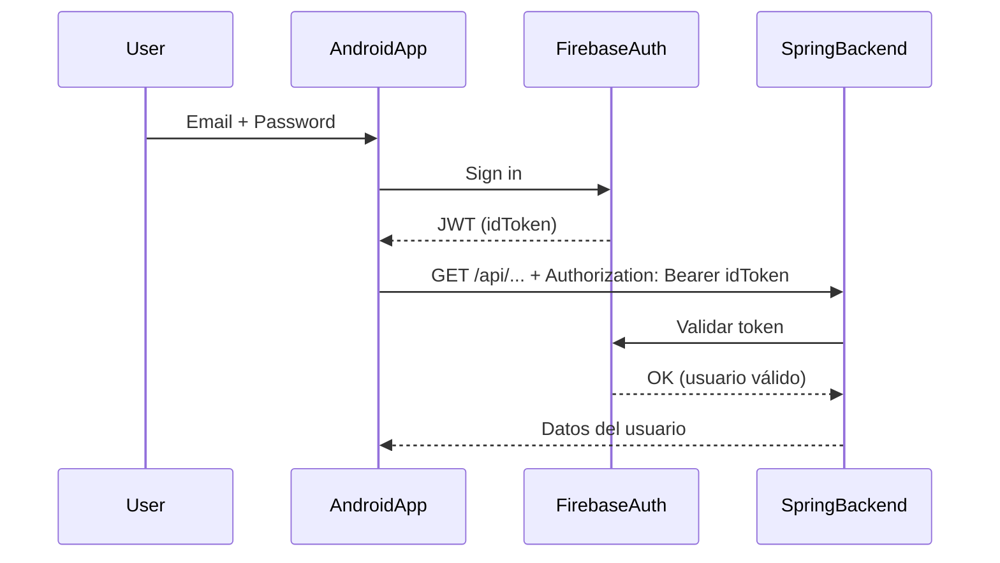

# BailotecaApp

Aplicación móvil desarrollada en **Kotlin** con **Jetpack Compose**, diseñada para complementar el sistema de gestión de academias de baile del proyecto *La Bailoteca*. Esta app permite a los usuarios acceder a funcionalidades como inicio de sesión, consulta de clases, eventos y notificaciones.

---

## Tecnologías utilizadas

- **Kotlin**
- **Jetpack Compose** (UI declarativa moderna)
- **Navigation Compose**
- **Material 3**
- **Arquitectura MVVM** *(próximamente)*
- **Firebase Authentication** *(próximamente)*

---

## Estructura del proyecto

```
com.example.bailotecaapp
├── data          # Modelos y repositorios (pendiente)
├── navigation    # Sistema de navegación
├── ui
│   ├── components # Elementos reutilizables
│   ├── screens    # Pantallas individuales (Login, Home...)
│   └── theme      # Personalización visual
├── utils         # Constantes, helpers, etc.
└── MainActivity.kt # Punto de entrada de la app
```

---

## Funcionalidades implementadas

### Navegación básica entre pantallas

Se utiliza `Navigation Compose` para definir rutas seguras y controladas:

```kotlin
sealed class Screens(val route: String) {
    object Login : Screens("login")
    object Home : Screens("home")
}
```

La navegación se gestiona mediante un `NavController`, y las pantallas se declaran en `AppNavigation`.

### Pantalla de Login (demo)

Pantalla inicial con un botón de prueba que redirige a la pantalla de inicio:

```kotlin
Button(onClick = {
    navController.navigate(Screens.Home.route)
}) {
    Text("Entrar")
}
```

### Pantalla de Inicio

Muestra un mensaje simple de bienvenida. Será extendida próximamente.

---

## Justificación de decisiones

| Elemento              | Razón de uso                                      |
|-----------------------|--------------------------------------------------|
| **Jetpack Compose**   | UI moderna, mantenible y sin XML                 |
| **Navigation Compose**| Navegación declarativa, fácil integración        |
| **MVVM** *(próximamente)* | Separación de lógica de UI y estado             |
| **sealed class Screens** | Seguridad en rutas y mejor mantenibilidad       |
| **Scaffold**          | Layout base que respeta márgenes del sistema     |

---

## Próximos pasos

- Integrar Firebase Authentication.
- Implementar arquitectura MVVM con ViewModel y Repository.
- Crear pantalla de listado de clases.
- Mostrar eventos y notificaciones.
- Sincronización con el backend REST en Spring Boot.

---

## LOGIN

### Diagrama de Flujo del Funcionamiento del Login

Este diagrama describe el flujo de autenticación del usuario en la aplicación La Bailoteca:




## Capturas de pantalla

*(Se añadirán más adelante cuando haya contenido visual).*

---

## Autor

Desarrollado por **Antonio Manuel Aragón Pérez** como parte del proyecto final *La Bailoteca*.