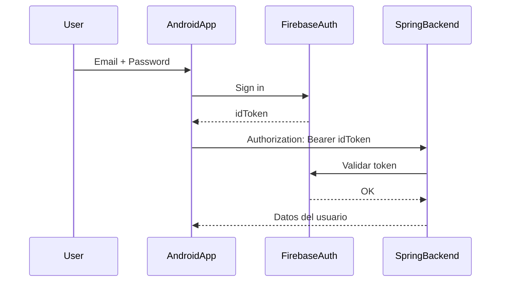

# La Bailoteca App — Android Frontend

Aplicación móvil desarrollada en **Kotlin** con **Jetpack Compose**, como interfaz para los usuarios del sistema La Bailoteca. Conectada al backend Spring Boot mediante Retrofit y protegida por Firebase Authentication y JWT.

---

## Tecnologías utilizadas

- Kotlin + Jetpack Compose
- Navigation Compose
- Material 3 (UI moderna)
- MVVM (en proceso)
- Retrofit + Gson
- Firebase Authentication

---

## Estructura del proyecto

```
bailoteca-frontend/
├── data            # Modelos y ViewModels
├── navigation      # Gestor de rutas
├── ui
│   ├── components  # Elementos reutilizables (botones, inputs)
│   ├── screens     # Pantallas (Login, Home...)
│   └── theme       # Colores, tipografía, formas
├── utils           # Constantes y helpers
└── MainActivity.kt # Punto de entrada
```

---

## Funcionalidades implementadas

### Login con Firebase

- Registro e inicio de sesión con email y contraseña
- Obtención del token JWT desde Firebase
- Envío del token al backend Spring Boot

### Consulta de usuarios

- Petición protegida al backend para obtener datos reales
- Validación del token en backend
- Renderizado en pantalla con Compose

### Navegación declarativa

- `NavController` para moverse entre pantallas
- Rutas seguras usando `sealed class Screens`

```kotlin
sealed class Screens(val route: String) {
    object Login : Screens("login")
    object Home : Screens("home")
    object Usuarios : Screens("usuarios")
}
```

---

## Diagrama de flujo de autenticación



---

## Conexión con backend (Retrofit)

```kotlin
Retrofit.Builder()
    .baseUrl("http://10.0.2.2:8080/api/")
    .addConverterFactory(GsonConverterFactory.create())
    .build()
```

Se utilizan endpoints como:
- `GET /usuarios/me`
- `GET /usuarios`

---

## Seguridad

- El token de Firebase se envía en cada petición protegida
- El backend valida el token y devuelve datos solo si es válido
- Se usa `Authorization: Bearer <idToken>`

---

## Próximos pasos

- Arquitectura MVVM completa (con ViewModel y Repository)
- Pantalla de inscripción en clases y eventos
- Integración de notificaciones (mensajes / avisos)
- Mejora visual con temas personalizados

---

## Capturas de pantalla

*(Se añadirán más adelante)*

---

## Autor
**Antonio Manuel Aragón Pérez** — 2º DAM, Curso 24/25

---