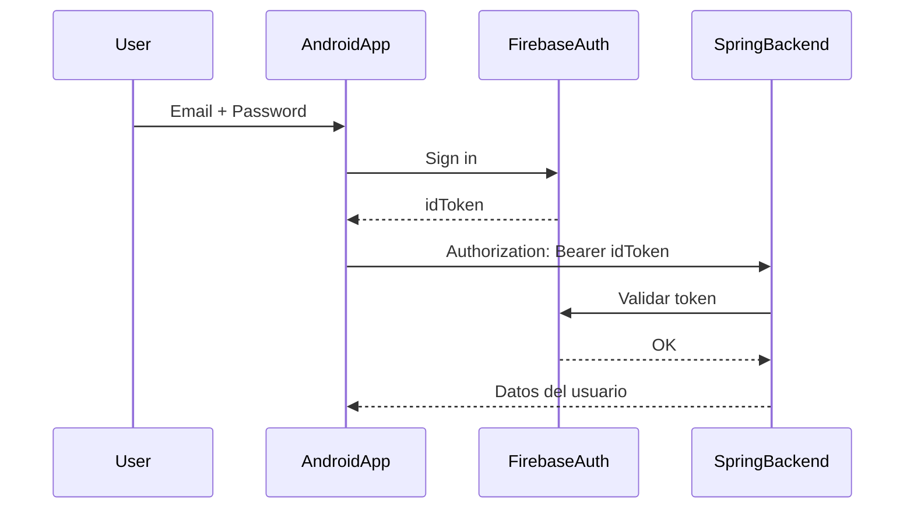

# La Bailoteca App — Android Frontend

Aplicación móvil desarrollada en **Kotlin** con **Jetpack Compose**, como interfaz para los usuarios del sistema La Bailoteca. Conectada al backend Spring Boot mediante Retrofit y protegida por Firebase Authentication y JWT.

---

## Tecnologías utilizadas

- Kotlin + Jetpack Compose
- Navigation Compose
- Material 3 (UI moderna)
- MVVM (en proceso)
- Retrofit + Gson
- Firebase Authentication

---

## Estructura del proyecto

```
bailoteca-frontend/
├── data            # Modelos y ViewModels
├── navigation      # Gestor de rutas
├── ui
│   ├── components  # Elementos reutilizables (botones, inputs)
│   ├── screens     # Pantallas (Login, Home...)
│   └── theme       # Colores, tipografía, formas
├── utils           # Constantes y helpers
└── MainActivity.kt # Punto de entrada
```

---

## Funcionalidades implementadas

### Login con Firebase

- Registro e inicio de sesión con email y contraseña
- Obtención del token JWT desde Firebase
- Envío del token al backend Spring Boot

### Consulta de usuarios

- Petición protegida al backend para obtener datos reales
- Validación del token en backend
- Renderizado en pantalla con Compose

### Navegación declarativa

- `NavController` para moverse entre pantallas
- Rutas seguras usando `sealed class Screens`

```kotlin
sealed class Screens(val route: String) {
    object Login : Screens("login")
    object Home : Screens("home")
    object Usuarios : Screens("usuarios")
}
```

---

## Diagrama de flujo de autenticación



---

## Conexión con backend (Retrofit)

```kotlin
Retrofit.Builder()
    .baseUrl("http://10.0.2.2:8080/api/")
    .addConverterFactory(GsonConverterFactory.create())
    .build()
```

Se utilizan endpoints como:
- `GET /usuarios/me`
- `GET /usuarios`

---

## Seguridad

- El token de Firebase se envía en cada petición protegida
- El backend valida el token y devuelve datos solo si es válido
- Se usa `Authorization: Bearer <idToken>`

### Inscripción de usuarios a clases

El backend expone un endpoint:

- **POST** `/api/inscripciones?claseId={id}`: Permite registrar la inscripción del usuario autenticado en una clase.
- También permite obtener inscripciones por usuario o por clase.

El modelo **Inscripcion** relaciona:

- **Usuario**: Información del usuario inscrito.
- **Clase**: Detalles de la clase.
- **Fecha**: Representada como `LocalDate`.
- **Estado**: Representado por `EstadoInscripcion`.

En el frontend (Jetpack Compose):

- Se accede a las inscripciones del usuario para controlar el estado de la UI (botón "Inscribirme").
- Si el usuario ya está inscrito:
  - Se oculta el botón.
  - Se muestra el mensaje: **"Ya estás inscrito"**.
- Desde la pantalla de detalle, se permite cancelar la inscripción.

Se corrigieron problemas de mapeo asegurando que los modelos de Kotlin reflejen correctamente la estructura anidada del backend:

- **usuario**: Representado por el modelo `Usuario`.
- **clase**: Representada por el modelo `Clase`.

---

## Navegación general y estructura principal

Se ha implementado una estructura de navegación global basada en **Scaffold** de Jetpack Compose, que incluye:

- **TopAppBar**: Barra superior con el título de la app y botón de menú lateral.
- **Drawer lateral**: Implementado con `ModalNavigationDrawer`, mostrando las rutas disponibles según el rol del usuario.
- **Sistema de navegación central**: `AppNavigation` conectado dentro del Scaffold para permitir el cambio de pantallas de forma fluida.
- **Correcto manejo del padding**: Evita solapamiento con la TopAppBar.

### Archivos relevantes

- **MainScaffold.kt**: Contenedor principal de la app con barra superior y drawer.
- **DrawerContent.kt**: Lista de rutas del menú lateral.
- **AppNavigation.kt**: Rutas navegables dentro de la aplicación.

### Apuntes personales

#### ¿Qué es Scaffold?

- Es una estructura base en Jetpack Compose que permite colocar de forma ordenada elementos como barras superiores, barras inferiores, menús laterales y el contenido principal.
- El Scaffold tiene un bloque `padding -> {}` que hay que respetar para evitar que el contenido se solape con otros elementos visuales (como la barra superior).

#### ¿Cómo se ha montado la navegación?

1. Se usa `ModalNavigationDrawer` para el menú lateral.
2. Dentro del drawer, se utiliza una función `DrawerContent()` personalizada que llama a `navController.navigate(destino)` al pulsar una opción.
3. El contenido principal del Scaffold llama a `AppNavigation`, que contiene todas las rutas (LoginScreen, HomeScreen, etc.).
4. Se usa `rememberCoroutineScope()` para abrir/cerrar el drawer animadamente con `drawerState.open()` y `drawerState.close()`.

### Navegación y menú lateral

La aplicación móvil usa un sistema de navegación centralizado basado en Jetpack Compose Navigation.

#### Componentes clave:
- `MainScaffold.kt`: define el layout principal con AppBar, Drawer y Navigation.
- `DrawerContent.kt`: menú lateral dinámico basado en el rol del usuario.
- `DrawerDestinations.kt`: enum sellado que define las rutas disponibles para cada tipo de usuario.
- `SesionViewModel.kt`: mantiene el estado del usuario autenticado de forma reactiva.

#### Roles soportados:
- `ADMIN`: acceso completo a usuarios, clases, perfil y logout.
- `PROFESOR`: acceso a clases, perfil y logout.
- `USUARIO`: acceso a clases, perfil y logout.

#### Comportamiento:
- El menú se muestra como un `ModalNavigationDrawer` con un ancho fijo (`280.dp`).
- El contenido se adapta automáticamente cuando el drawer está abierto.
- La sesión permanece activa hasta que el usuario cierra sesión explícitamente.


## Próximos pasos

- Arquitectura MVVM completa (con ViewModel y Repository)
- Pantalla de inscripción en clases y eventos
- Integración de notificaciones (mensajes / avisos)
- Mejora visual con temas personalizados

---

## Capturas de pantalla

*(Se añadirán más adelante)*

---

## Autor
**Antonio Manuel Aragón Pérez** — 2º DAM, Curso 24/25

---