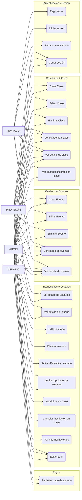

```mermaid
flowchart LR
    subgraph group1 ["Gestión de Clases"]
        direction TB
        CL_CreateClase("Crear Clase")
        CL_EditClase("Editar Clase")
        CL_DeleteClase("Eliminar Clase")
        CL_ListClases("Ver listado de clases")
        CL_DetailClase("Ver detalle de clase")
        CL_ViewEnrolled("Ver alumnos inscritos en clase")
    end
    subgraph group2 ["Gestión de Eventos"]
        direction TB
        EV_CreateEvento("Crear Evento")
        EV_EditEvento("Editar Evento")
        EV_DeleteEvento("Eliminar Evento")
        EV_ListEventos("Ver listado de eventos")
        EV_DetailEvento("Ver detalle de evento")
    end
    subgraph group3 ["Inscripciones y Usuarios"]
        direction TB
        IU_ListUsuarios("Ver listado de usuarios")
        IU_DetailUsuario("Ver detalle de usuario")
        IU_EditUsuario("Editar usuario")
        IU_DeleteUsuario("Eliminar usuario")
        IU_ToggleUsuario("Activar/Desactivar usuario")
        IU_ViewUserInscripciones("Ver inscripciones de usuario")
        IU_InscribirClase("Inscribirse en clase")
        IU_CancelInscripcion("Cancelar inscripción en clase")
        IU_ViewOwnInscripciones("Ver mis inscripciones")
        IU_EditPerfil("Editar perfil")
    end
    subgraph group4 [Pagos]
        direction TB
        PA_RegistrarPago("Registrar pago de alumno")
    end
    subgraph group5 ["Autenticación y Sesión"]
        direction TB
        AU_Registrarse("Registrarse")
        AU_Login("Iniciar sesión")
        AU_GuestLogin("Entrar como invitado")
        AU_Logout("Cerrar sesión")
    end

    Admin[ADMIN]
    Profesor[PROFESOR]
    Usuario[USUARIO]
    Invitado[INVITADO]

    %% Relaciones actor-caso de uso:
    Admin --> CL_CreateClase
    Admin --> CL_EditClase
    Admin --> CL_DeleteClase
    Admin --> CL_ListClases
    Admin --> CL_DetailClase
    Admin --> CL_ViewEnrolled

    Profesor --> CL_CreateClase
    Profesor --> CL_EditClase
    Profesor --> CL_DeleteClase
    Profesor --> CL_ListClases
    Profesor --> CL_DetailClase
    Profesor --> CL_ViewEnrolled

    Usuario --> CL_ListClases
    Usuario --> CL_DetailClase

    Invitado --> CL_ListClases
    Invitado --> CL_DetailClase

    Admin --> EV_CreateEvento
    Admin --> EV_EditEvento
    Admin --> EV_DeleteEvento
    Admin --> EV_ListEventos
    Admin --> EV_DetailEvento

    Profesor --> EV_CreateEvento
    Profesor --> EV_EditEvento
    Profesor --> EV_DeleteEvento
    Profesor --> EV_ListEventos
    Profesor --> EV_DetailEvento

    Usuario --> EV_ListEventos
    Usuario --> EV_DetailEvento

    Invitado --> EV_ListEventos
    Invitado --> EV_DetailEvento

    Admin --> IU_ListUsuarios
    Admin --> IU_DetailUsuario
    Admin --> IU_EditUsuario
    Admin --> IU_DeleteUsuario
    Admin --> IU_ToggleUsuario
    Admin --> IU_ViewUserInscripciones

    Profesor --> IU_ListUsuarios
    Profesor --> IU_DetailUsuario
    Profesor --> IU_ViewUserInscripciones

    Usuario --> IU_InscribirClase
    Usuario --> IU_CancelInscripcion
    Usuario --> IU_ViewOwnInscripciones
    Usuario --> IU_EditPerfil

    Profesor --> IU_EditPerfil
    Admin --> IU_EditPerfil

    Admin --> PA_RegistrarPago
    Profesor --> PA_RegistrarPago

    Invitado --> AU_Registrarse
    Invitado --> AU_Login
    Invitado --> AU_GuestLogin

    Usuario --> AU_Logout
    Profesor --> AU_Logout
    Admin --> AU_Logout
```