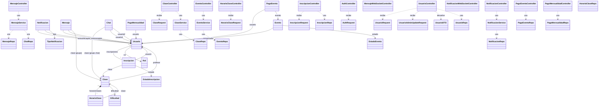

```mermaid
classDiagram
%% Backend Entities
class Usuario
class Clase
class HorarioClase
class Evento
class Inscripcion
class Notificacion
class Mensaje
class Chat
class PagoEvento
class PagoMensualidad

%% Backend DTOs
class ClaseRequest
class HorarioClaseRequest
class InscripcionRequest
class UsuarioRequest
class UsuarioAdminUpdateRequest
class UsuarioDTO
class AuthRequest

%% Backend Enums
class Dificultad
class EstadoEvento
class EstadoInscripcion
class Rol
class TipoNotificacion

%% Backend Controllers
class AuthController
class ClaseController
class HorarioClaseController
class EventoController
class InscripcionController
class MensajeController
class MensajeWebSocketController
class NotificacionController
class NotificacionWebSocketController
class PagoEventoController
class PagoMensualidadController
class UsuarioController

%% Backend Services
class MensajeService
class ClaseService
class EventoService
class NotificacionService

%% Backend Repositories
class ChatRepo
class MensajeRepo
class ClaseRepo
class HorarioClaseRepo
class EventoRepo
class InscripcionRepo
class NotificacionRepo
class PagoEventoRepo
class PagoMensualidadRepo
class UsuarioRepo

%% Backend Relationships between Entities and Enums
Clase --> Usuario : profesor
Clase "1" *-- "*" HorarioClase : horarioClases
HorarioClase --> Clase : clase
Evento --> Usuario : organizador
Inscripcion --> Usuario : usuario
Inscripcion --> Clase : clase
Usuario "1" o-- "*" Inscripcion : inscripciones
Notificacion --> Usuario : emisor
Notificacion --> Usuario : receptor
Notificacion --> TipoNotificacion : tipo
Mensaje --> Usuario : emisor
Mensaje --> Usuario : receptor
Mensaje --> Clase : clase (grupo)
Chat --> Clase : clase (grupo chat)
Chat --> Usuario : usuario1
Chat --> Usuario : usuario2
PagoEvento --> Usuario : usuario
PagoEvento --> Evento : evento
PagoMensualidad --> Usuario : usuario
Usuario --> Rol : rol
Clase --> Dificultad : dificultad
Evento --> EstadoEvento : estado
Inscripcion --> EstadoInscripcion : estado

%% Backend Dependencies and Uses
AuthController ..> AuthRequest : recibe
ClaseController ..> ClaseRequest : recibe
HorarioClaseController ..> HorarioClaseRequest : recibe
InscripcionController ..> InscripcionRequest : recibe
UsuarioController ..> UsuarioRequest : recibe
UsuarioController ..> UsuarioAdminUpdateRequest : recibe
UsuarioController ..> UsuarioDTO : devuelve
ClaseController ..> ClaseService : usa
ClaseService ..> ClaseRepo : usa
EventoController ..> EventoService : usa
EventoService ..> EventoRepo : usa
InscripcionController ..> InscripcionRepo : usa
MensajeController ..> MensajeService : usa
MensajeService ..> MensajeRepo : usa
MensajeService ..> ChatRepo : usa
NotificacionController ..> NotificacionService : usa
NotificacionService ..> NotificacionRepo : usa
PagoEventoController ..> PagoEventoRepo : usa
PagoMensualidadController ..> PagoMensualidadRepo : usa
UsuarioController ..> UsuarioRepo : usa
```