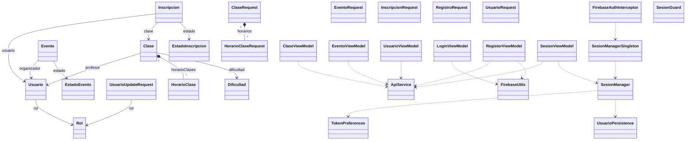

```mermaid
classDiagram
%% Frontend Data Models
class Usuario
class Clase
class HorarioClase
class Evento
class Inscripcion

%% Frontend DTOs
class ClaseRequest
class EventoRequest
class HorarioClaseRequest
class InscripcionRequest
class RegistroRequest
class UsuarioRequest
class UsuarioUpdateRequest

%% Frontend Enums
class Dificultad
class EstadoEvento
class EstadoInscripcion
class Rol

%% Frontend Services & Utils
class ApiService
class FirebaseAuthInterceptor
class FirebaseUtils

%% Frontend Session & Persistence
class TokenPreferences
class UsuarioPersistence
class SesionManager
class SesionManagerSingleton
class SesionGuard

%% Frontend ViewModels
class ClaseViewModel
class EventoViewModel
class UsuarioViewModel
class LoginViewModel
class RegisterViewModel
class SesionViewModel

%% Relaciones entre modelos y enums
Clase --> Usuario : profesor
Clase "1" *-- "*" HorarioClase : horarioClases
Evento --> Usuario : organizador
Inscripcion --> Usuario : usuario
Inscripcion --> Clase : clase
Usuario --> Rol : rol
Clase --> Dificultad : dificultad
Evento --> EstadoEvento : estado
Inscripcion --> EstadoInscripcion : estado
ClaseRequest "1" *-- "*" HorarioClaseRequest : horarios
UsuarioUpdateRequest --> Rol : rol

%% Dependencias ViewModel y servicios
ClaseViewModel ..> ApiService
EventoViewModel ..> ApiService
UsuarioViewModel ..> ApiService
RegisterViewModel ..> ApiService
RegisterViewModel ..> FirebaseUtils
LoginViewModel ..> FirebaseUtils
SesionViewModel ..> ApiService
SesionViewModel ..> SesionManager
SesionManager ..> TokenPreferences
SesionManager ..> UsuarioPersistence
FirebaseAuthInterceptor ..> SesionManagerSingleton
SesionManagerSingleton ..> SesionManager
```