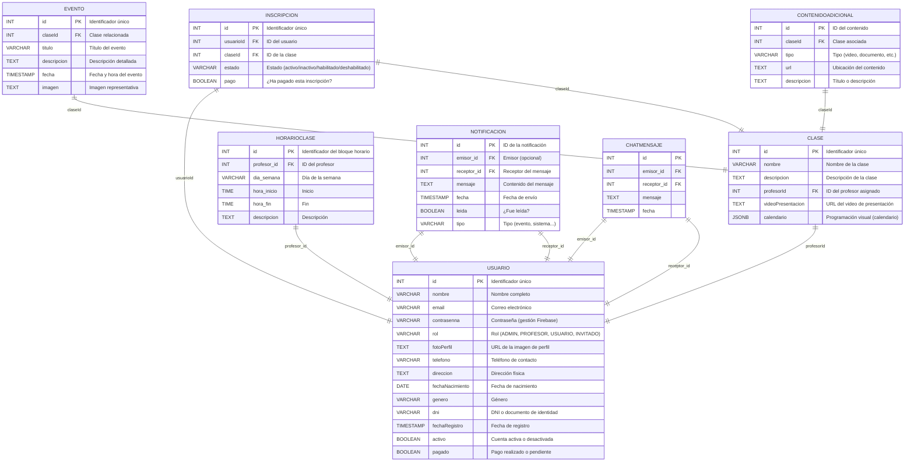

```mermaid
erDiagram
    USUARIO {
        INT id PK "Identificador único"
        VARCHAR nombre "Nombre completo"
        VARCHAR email "Correo electrónico"
        VARCHAR contrasenna "Contraseña (gestión Firebase)"
        VARCHAR rol "Rol (ADMIN, PROFESOR, USUARIO, INVITADO)"
        TEXT fotoPerfil "URL de la imagen de perfil"
        VARCHAR telefono "Teléfono de contacto"
        TEXT direccion "Dirección física"
        DATE fechaNacimiento "Fecha de nacimiento"
        VARCHAR genero "Género"
        VARCHAR dni "DNI o documento de identidad"
        TIMESTAMP fechaRegistro "Fecha de registro"
        BOOLEAN activo "Cuenta activa o desactivada"
        BOOLEAN pagado "Pago realizado o pendiente"
    }

    CLASE {
        INT id PK "Identificador único"
        VARCHAR nombre "Nombre de la clase"
        TEXT descripcion "Descripción de la clase"
        INT profesorId FK "ID del profesor asignado"
        TEXT videoPresentacion "URL del video de presentación"
        JSONB calendario "Programación visual (calendario)"
    }

    CLASE ||--|| USUARIO : profesorId

    HORARIOCLASE {
        INT id PK "Identificador del bloque horario"
        INT profesor_id FK "ID del profesor"
        VARCHAR dia_semana "Día de la semana"
        TIME hora_inicio "Inicio"
        TIME hora_fin "Fin"
        TEXT descripcion "Descripción"
    }

    HORARIOCLASE ||--|| USUARIO : profesor_id

    INSCRIPCION {
        INT id PK "Identificador único"
        INT usuarioId FK "ID del usuario"
        INT claseId FK "ID de la clase"
        VARCHAR estado "Estado (activo/inactivo/habilitado/deshabilitado)"
        BOOLEAN pago "¿Ha pagado esta inscripción?"
    }

    INSCRIPCION ||--|| USUARIO : usuarioId
    INSCRIPCION ||--|| CLASE : claseId

    EVENTO {
        INT id PK "Identificador único"
        INT claseId FK "Clase relacionada"
        VARCHAR titulo "Título del evento"
        TEXT descripcion "Descripción detallada"
        TIMESTAMP fecha "Fecha y hora del evento"
        TEXT imagen "Imagen representativa"
    }

    EVENTO ||--|| CLASE : claseId

     NOTIFICACION {
        INT id PK "ID de la notificación"
        INT emisor_id FK "Emisor (opcional)"
        INT receptor_id FK "Receptor del mensaje"
        TEXT mensaje "Contenido del mensaje"
        TIMESTAMP fecha "Fecha de envío"
        BOOLEAN leida "¿Fue leída?"
        VARCHAR tipo "Tipo (evento, sistema...)"
    }

    NOTIFICACION ||--|| USUARIO : emisor_id
    NOTIFICACION ||--|| USUARIO : receptor_id

     CONTENIDOADICIONAL {
        INT id PK "ID del contenido"
        INT claseId FK "Clase asociada"
        VARCHAR tipo "Tipo (video, documento, etc.)"
        TEXT url "Ubicación del contenido"
        TEXT descripcion "Título o descripción"
    }

    CONTENIDOADICIONAL ||--|| CLASE : claseId

     CHATMENSAJE {
        INT id PK
        INT emisor_id FK
        INT receptor_id FK
        TEXT mensaje
        TIMESTAMP fecha
    }

    CHATMENSAJE ||--|| USUARIO : emisor_id
    CHATMENSAJE ||--|| USUARIO : receptor_id
    
```